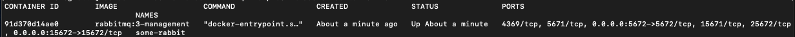

# RabbitMQ-Exemplo01

Neste exemplo você precisa já ter instalado em seu computador:
- .Net Core 3.1
- Docker
- Editor de código, neste exemplo estou usando o VsCode

Primeiro passo é subir um ambiente RabbitMQ utilizando o Docker, para isso rode o comando abaixo em seu cmd\terminal:

docker run -d --hostname my-rabbit --name some-rabbit -p 15672:15672 -p 5672:5672  rabbitmq:3-management   

Este comando ira baixar a imagem do RabbitMQ3 Management, e ao criar o container ira mapear a porta default 15672 para acessar o Rabbit via browser, a porta 5672 para o trafego das mensagens via protocolo amqp e definimos o nome default do host para my-rabbit

Para validar se o container está em execução, basta executar o comando docker container ls

Agora basta acessar o RabbitMQ no navegar através da url http://localhost:15672/, o usuário default para o login é:
- Usuario: guest
- Senha: guest

# Queues

# Exchange

# Visão Geral do Publish \ Subscribe 

# Documentação Rabbit
Por fim, o site do próprio RabbitMQ tem muita informação, muitos exemplos em diversas linguagens e que com certeza vai te ajudar.

Link: https://www.rabbitmq.com/getstarted.html