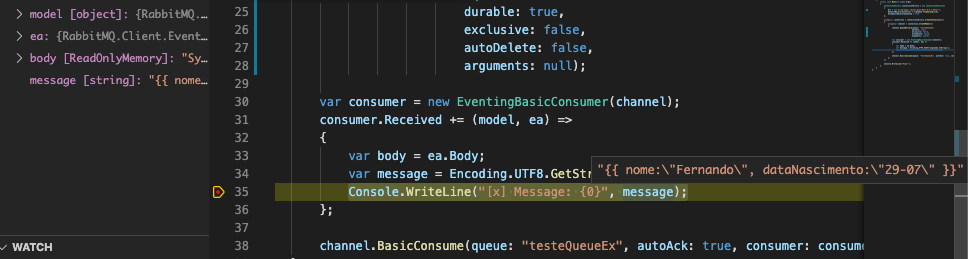

# RabbitMQ-Exemplo01

Neste exemplo você precisa já ter instalado em seu computador:
- .Net Core 3.1
- Docker instalado e configurado
- Editor de código, neste exemplo utiilizei o VsCode durante o desenvolvimento

Primeiro passo é subir um ambiente RabbitMQ utilizando o Docker, para isso rode o comando abaixo em seu cmd\terminal:

docker run -d --hostname my-rabbit --name some-rabbit -p 15672:15672 -p 5672:5672  rabbitmq:3-management   

Este comando ira baixar a imagem do RabbitMQ3 Management, e ao criar o container ira mapear a porta default 15672 para acessar o Rabbit via browser, a porta 5672 para o trafego das mensagens via protocolo amqp e definimos o nome default do host para my-rabbit

Para validar se o container está em execução, basta executar o comando docker container ls

Agora basta acessar o RabbitMQ no navegar através da url http://localhost:15672/, o usuário default para o login é:
- Usuario: guest
- Senha: guest

- Configurando a Queue e o Exchange:
Embora seja explicado nos próximos tópicos o que\para que serve a Queue e a Exchange, acho importante ja configurarmos uma e ver funcionando, assim quando vier a explicação, tudo fará sentido.

No projeto de Read da fila você vera que embora seja um projeto de leitura existe uma declaração de uma Queue, isto não tem problema, desde que todos os projetos que utilizem a Queue estajam parametrizando elas com os mesmos valores, vou dar uma quebra de linha para ficar mais facil a visualização da Queue declarada:

Neste exemplo vamos configurar a Queue via browser e já realizar o vinculo com a Exchange, para criar a Queue basta acessar o menu Queues e você verá na página que foi aberta no lado esquerdo um botão com o texto "Add queue", basta clicar sobre ele e preencher os dados da Queue:
- Type: Classic
- Name: testeQueueEx
- Durability: Durable
- Auto Delete: No
- Arquments: [Não preencher]

Após basta clicar novamente sobre o botão "Add queue", que a mesma será salva e você será redirecionado para as queues existentes, contendo agora a sua:

Ao lado do menu da Queues, você tem acesso ao menu Exchanges, clique sobre ele para ver as Exchanges existentes, em seguida clique na opção "amq.fanout"

Ao clicar na opção "amq.fanout" vocë será redirecionad a uma outra página, nesta página você verá uma opção chamada "Bindings", clique sobre ela, será nesse momento realizar um vinculo com a Queue que criamos no passo anterior, basta informar o nome da Queue e clicar em "bind":

Ao realizar o bind você verá uma imagem mostrando o vinculo criado:

Pronto! Seu ambiente está configurado e já podemos testar!

abra o projeto RabbitMqPublish e no terminal basta digitar "dotnet run", assim que for executado você no console um texto "Publish!"

Volte ao RabbitMQ, note na página overview que as mensagens já foram identificadas:

Ao acessar o menu Queues, você verá na queue que você criou que na tabela, na área Messages a coluna Ready e Total possuem agora um valor referente a quantidade de publish realizados e que ainda não foram lidos

Clique novamente sobre a queue que você criou, você será redirecionado a sua fila, nesta página além de conseguir ver a quantidade de mensagens que estão na fila para serem lidos:

Você tem mais abaixo um menu na página como nome de "Get messages", mantenhas as configurações da tela como o print abaixo e clique em seguida no botão "Get Message(s)"

Este passo apenas te ajuda a visualizar a sua mensagem, mas não remove ela da fila e também não existe nenhum processamento sobre a mesma ainda, isto será feito neste momento.

No VsCode coloque um breakpoint sobre Console.Write na linha 35 e em sseguida inicialize o modo de depuração do vscode

Assim que a mensagem for lida, ao passar o mouse sobre a propriedade mesage note que você já consegue ver o conteúdo

Assim que concluir o debug, você verá que as mensagens lidas, tem seu conteúdo escrito no console junto com a palavra "Read!":

Importante voltar ao navegador do RabbitMQ e ver como ficou a Queue após a leitura, acesse o menu Queue, você verá que a quantidade de mensagens agora da fila é 0 novamente, ao acessar sua Queue veja no gráfico que após as mensagens serem lidas elas foram removidas e o gráfico ajuda inclusive a ver este momento:

# Visão Geral do Publish \ Subscribe 

Agora que você já configurou e já viu uma mensagem sendo envianda e também já fez a leitura do conteúdo das mensagens na fila, vamos entender melhor o que são cada coisa e como elas se relacionam...

# Queues

# Exchange

# Documentação RabbitMQ
Por fim, o site do próprio RabbitMQ tem muita informação, muitos exemplos em diversas linguagens e que com certeza vai te ajudar.

Link: https://www.rabbitmq.com/getstarted.html